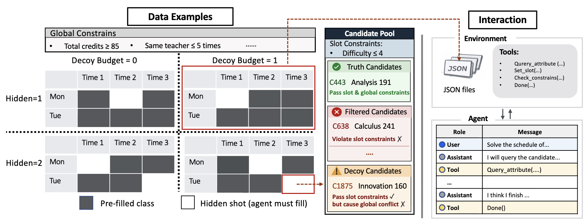

# ACE-Bench
 
**A**gent **C**onfigurable **E**valuation with Scalable Horizons and Controllable Difficulty under Lightweight Environments

## Generating Datasets



Pre-generated datasets for three grid sizes are already available under `data/` and can be used directly:

| Size | Hidden slots | Decoy budget | Directory |
|------|--------------|-----------------------|-----------|
| 5×5  | 1, 5, 7, 11, 15 | 0, 2, 4, 8, 10, 15, 19 | `data/5x5/` |
| 5×7  | 1, 5, 7, 11, 15, 21 | 0, 2, 4, 8, 10, 15, 19, 21, 25 | `data/5x7/` |
| 5×10 | 1, 3, 5, 7, 11, 15, 19, 21, 25 | 0, 2, 4, 8, 10, 15, 19, 21, 25, 30 | `data/5x10/` |

(Optional) If you wanna generate data, you could try the following command for all domains:
```bash
python data_generation/generate.py \
  --all-domains \
  --rows 5 --cols 5 \
  --hidden-slots 1 3 5 7 9 13 17 \
  --branch-budget 0 2 4 6 8 10 \
  --candidates-per-slot 15 \
  --max-retries 160 \
  --candidate-resample-retries 12 \
  --open-valid-preference-tries 30 50 70 \
  --seed 42 \
  --max-workers 36
```

For detailed parameter descriptions and generation logic, see [data_generation/README.md](data_generation/README.md).


python data_generation/generate.py --domain course  --rows 5 --cols 10 --hidden-slots 1 3 5 7 11 15 19 21 25 --branch-budget 0 2 4 8 10 15 19 21 25 30 --candidates-per-slot 35 --max-retries 400 --candidate-resample-retries 30 --open-valid-preference-tries 50 100 150 --seed 42 --max-workers 36

---

## Running the Benchmark

The evaluation entry point is `debug_vllm/debug.py`. Example:

```bash
nohup python debug_vllm/debug.py > debug_vllm/debug_log/qwen35_9b.log 2>&1 &
disown
```

For detailed usage and parameter descriptions, see [debug_vllm/README.md](debug_vllm/README.md).

---

## Analyzing Results


Run the interactive result viewer:

```bash
python show.py
```

Four options are available:

| Option | Description |
|--------|-------------|
| **1. Validate dataset** | Validate a generated dataset file, checking that truth solutions, slot constraints, and decoy multi-stage guarantees are all satisfied |
| **2. View model metric results** | Enter a model result directory (e.g. `results/5x7/.../GLM-4.7-FP8`) and view average score/token/cost metrics across hidden slot and branch budget (decoy) combinations |
| **3. Compare model metric results** | Load all models under a result directory in parallel and display a ranked comparison across metrics (score, cost, time, etc.), broken down by branch budget (decoy) |
| **4. View model messages** | Enter a single result JSON file path and display the full conversation between the agent and the environment in a two-column layout (assistant on the right, others on the left) |
