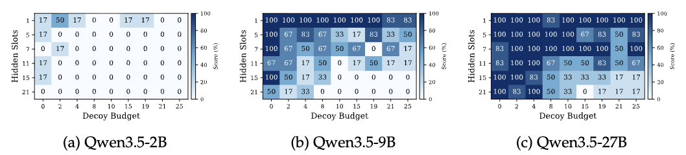

# AgentCE-Bench
 
**A**gent **C**onfigurable **E**valuation with Scalable Horizons and Controllable Difficulty under Lightweight Environments

## Installation

```bash
pip install -r requirements.txt
```

---

## Generating Datasets
Pre-generated datasets for three grid sizes are already available under `data/` and can be used directly:

| Size | Hidden slots | Decoy budget | Directory |
|------|--------------|-----------------------|-----------|
| 5×5  | 1, 5, 7, 11, 15 | 0, 2, 4, 8, 10, 15, 19 | `data/5x5/` |
| 5×7(Recommand)  | 1, 5, 7, 11, 15, 21 | 0, 2, 4, 8, 10, 15, 19, 21, 25 | `data/5x7/` |
| 5×10 | 1, 3, 5, 7, 11, 15, 19, 21, 25 | 0, 2, 4, 8, 10, 15, 19, 21, 25, 30 | `data/5x10/` |

(Optional) If you wanna generate data, you could try the following command for all domains:
```bash
python data_generation/generate.py \
  --all-domains \
  --rows 5 --cols 5 \
  --hidden-slots 1 3 5 7 9 13 17 \
  --branch-budget 0 2 4 6 8 10 \
  --candidates-per-slot 15 \
  --max-retries 160 \
  --candidate-resample-retries 12 \
  --open-valid-preference-tries 30 50 70 \
  --seed 42 \
  --max-workers 36
```

For detailed parameter descriptions and generation logic, see [data_generation/README.md](data_generation/README.md).

---

## Running the Benchmark

This project uses [LiteLLM](https://github.com/BerriAI/litellm) to access models via a unified API interface. For locally-hosted models, you need to start the corresponding inference service (e.g. vLLM) before running the benchmark.

Example (Qwen3.5-122B-A10B, all domains):
```bash
python main.py \
  --model "openai/Qwen/Qwen3.5-122B-A10B" \
  --agent-params '{"api_base":"http://localhost:8011/v1","temperature":1.0,"top_p":0.95,"top_k":20,"min_p":0.0,"presence_penalty":1.5,"repetition_penalty":1.0,"max_tokens":16384,"timeout":1800,"num_retries":1}' \
  --domain all \
  --data-dir data/5x7 \
  --max-steps 2000 \
  --save-path cached_results/ \
  --max-workers 64 \
  --num-trials 1 \
  --seed 42
```

Example (Qwen3.5-122B-A10B, `course` domain, specific hidden slots and branch budgets, different tool failure rates):
```bash
python main.py \
  --model "openai/Qwen/Qwen3.5-122B-A10B" \
  --agent-params '{"api_base":"http://localhost:8011/v1","temperature":1.0,"top_p":0.95,"top_k":20,"min_p":0.0,"presence_penalty":1.5,"repetition_penalty":1.0,"max_tokens":16384,"timeout":1800,"num_retries":1}' \
  --domain course \
  --data-dir data/5x7 \
  --max-steps 2000 \
  --tool-failure-rates "[0.0, 0.1]" \
  --save-path cached_results/ \
  --max-workers 64 \
  --num-trials 1 \
  --hidden-slots 5 11 15 \
  --branch-budget 0 4 8 \
  --seed 42
```

For running with a locally-hosted vLLM server (launching the server, configuring model endpoints, and full command-line parameter descriptions), see [run/README.md](debug_vllm/README.md).

---

## Analyzing Results




For heatmap visualization of model and domain scores, refer to [draw.ipynb](draw.ipynb).

